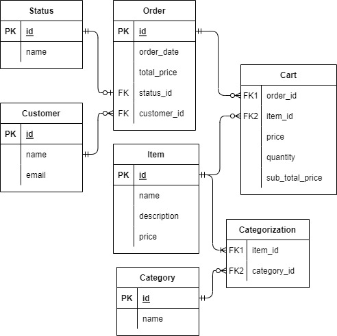

# Rails GIGIH Family Catering

## Description
This is a Final Project Assignment repository for Generasi GIGIH 2.0 Back-end Track. This project is a web apps that simulate the management of items and orders of a Catering business.

## ERD


## User Stories
- User should be able to create item
- User should be able to see all created item(s)
- User should be able to edit an existing item
- User should be able to delete an existing item
- User should be able to create order
- User should be able to edit the status of an existing order
- User should be able to see daily order

## Features
### Item's Categories
- Able to create a category
- Validation, Category name cannot be empty
- Able to see all created categories
- Able to edit an existing category
- Able to delete an existing category

### Item List
- Able to create an item
- Validation, Item name cannot be empty
- Validation, Item price cannot be empty
- Validation, Item category count cannot be zero
- Validation, Item description, if defined, cannot be more than 150 characters
- Able to see all created item(s)
- Able to edit an existing item
- Able to delete an existing item

### Order List
- Able to create an order
- Validation, Customer name cannot be empty
- Validation, Customer email cannot be empty
- Validation, Item(s) count cannot be zero
- Validation, Item quantity value defaulted to one (1)
- Able to see all created order(s)
- Automation, all NEW status-ed order will be set to CANCELLED starting at 5 PM
- Able to edit the status of an existing NEW status-ed order
- Able to delete an existing order
- Able to see present day's order(s)
- Able to see all time's order(s)
- Able to generate report, to see all order(s) by customer's email
- Able to generate report, to see PAID status-ed order(s) by determined total price of the order

### Customer List
- Able to create a customer
- Validation, Customer name cannot be empty
- Validation, Customer email cannot be empty
- Able to see all created customer(s)
- Able to edit an existing category
- Able to delete an existing category

## Getting Started
### Steps to run this locally or on Replit
```bash
# install the required libraries and depenencies
$ bundle install

# run the database migrations
$ rails db:migrate

# run the test database migrations
$ rails db:migrate RAILS_ENV=test

# populate some tables from the seeder
$ rails db:seed

# run the prepared rspec (add "bundle install" in front, if being run on Replit)
$ rspec -fd

# start the local server
$ rails s
```

## Folders Overview
- `app/models` - Contains the database models for the application where methods, validations, queries, and relations to other models could be defined.
- `app/views` - Contains templates for generating the JSON output for the API
- `app/controllers` - Contains the controllers where requests are routed to their actions, where models could be found and manipulated and then returned for the views to render.
- `config` - Contains configuration files for the Rails application and for the database, along with an `initializers` folder for scripts that get run on boot.
- `db` - Contains the migrations needed to create the database schema.
